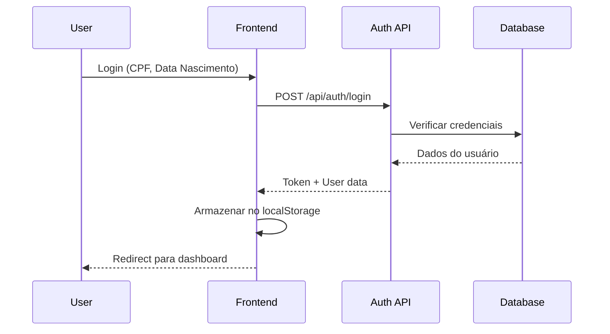
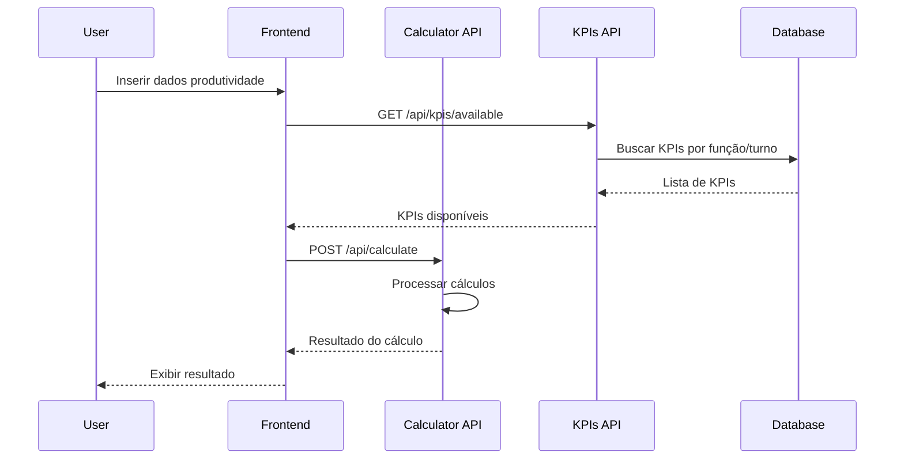
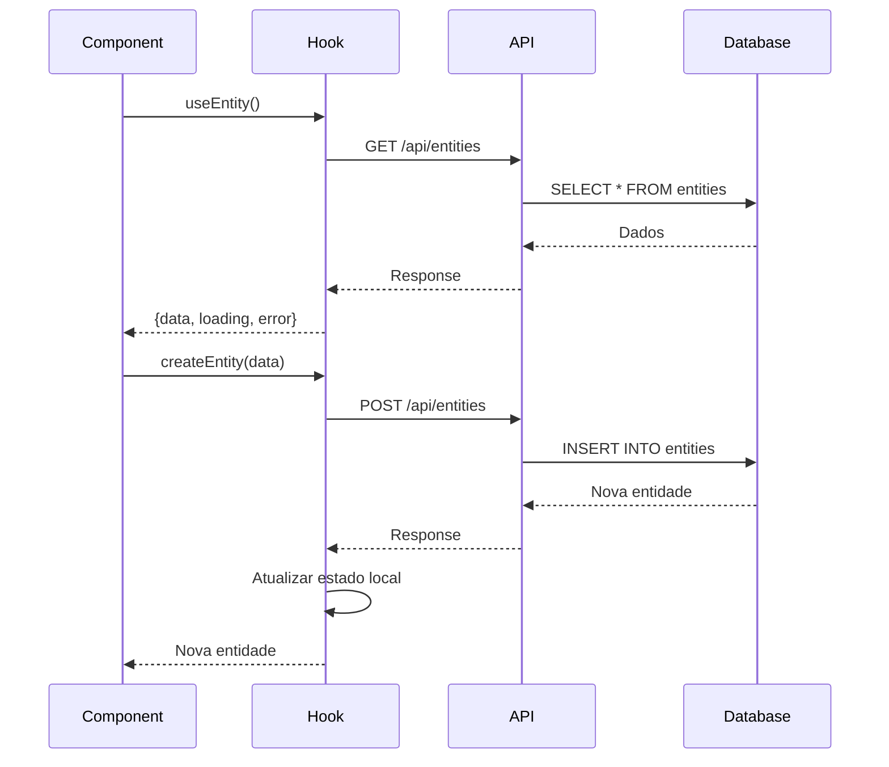

# Documentação de Padronização dos Fluxos

## 📋 Visão Geral

Este documento estabelece os padrões e diretrizes para desenvolvimento e manutenção dos fluxos de dados no Sistema RV Armazém, garantindo consistência, qualidade e manutenibilidade do código.

## 🏗️ Arquitetura do Sistema

### Frontend (React + TypeScript)
- **Localização**: `src/`
- **Tecnologias**: React, TypeScript, Vite
- **Padrões**: Hooks customizados, Context API, componentes funcionais

### Backend (Netlify Functions)
- **Localização**: `src/worker/routes/`
- **Tecnologias**: Node.js, TypeScript, Supabase
- **Padrões**: RESTful APIs, middleware de autenticação

### Banco de Dados
- **Tecnologia**: Supabase (PostgreSQL)
- **Configuração**: `.env.local`

## 📚 Padrões de Hooks

### 1. Estrutura Base dos Hooks CRUD

```typescript
export function useEntity() {
  const [entities, setEntities] = useState<EntityType[]>([]);
  const [loading, setLoading] = useState(true);
  const [error, setError] = useState<string | null>(null);

  useEffect(() => {
    fetchEntities();
  }, []);

  const fetchEntities = async () => {
    try {
      setLoading(true);
      const response = await fetch(`${API_BASE}/entities`);
      if (!response.ok) {
        throw new Error('Failed to fetch entities');
      }
      const data = await response.json();
      setEntities(data);
    } catch (err) {
      setError(err instanceof Error ? err.message : 'Unknown error');
    } finally {
      setLoading(false);
    }
  };

  // Métodos CRUD...

  return {
    entities,
    loading,
    error,
    refetch: fetchEntities,
    createEntity,
    updateEntity,
    deleteEntity,
  };
}
```

### 2. Padrões Obrigatórios

#### Estados Padrão
- ✅ `loading: boolean` - Estado de carregamento
- ✅ `error: string | null` - Mensagens de erro
- ✅ `data: EntityType[]` - Dados da entidade

#### Tratamento de Erro
```typescript
catch (err) {
  setError(err instanceof Error ? err.message : 'Unknown error');
}
```

#### Loading States
```typescript
try {
  setLoading(true);
  // operação assíncrona
} finally {
  setLoading(false);
}
```

#### Estrutura de Retorno
```typescript
return {
  data,
  loading,
  error,
  refetch,
  // métodos CRUD
};
```

## 🔌 Padrões de API

### 1. Endpoints Padronizados

| Entidade | Endpoint Base | Métodos Suportados |
|----------|---------------|--------------------|
| Usuários | `/api/usuarios` | GET, POST, PUT, DELETE |
| Atividades | `/api/activities` | GET, POST, PUT, DELETE |
| KPIs | `/api/kpis` | GET, POST, PUT, DELETE |
| Lançamentos | `/api/lancamentos` | GET, POST, PUT, DELETE |
| Calculadora | `/api/calculate` | POST |
| Autenticação | `/api/auth/login` | POST |

### 2. Estrutura de Resposta

#### Sucesso
```json
{
  "data": [...],
  "message": "Success",
  "status": 200
}
```

#### Erro
```json
{
  "error": "Error message",
  "status": 400
}
```

### 3. Headers Padrão
```typescript
headers: {
  'Content-Type': 'application/json',
  // Adicionar Authorization quando necessário
}
```

## 📝 Padrões de Tipagem

### 1. Tipos Base
```typescript
// src/shared/types.ts
export interface BaseEntity {
  id: string;
  created_at: string;
  updated_at: string;
}

export interface UserType extends BaseEntity {
  nome: string;
  cpf: string;
  funcao: string;
  turno: string;
  // outros campos...
}

export interface ActivityType extends BaseEntity {
  nome: string;
  descricao?: string;
}

export interface KPIType extends BaseEntity {
  nome: string;
  funcao: string;
  turno: string;
  meta: number;
  bonus: number;
}
```

### 2. Tipos de Hook
```typescript
export interface UseEntityReturn<T> {
  data: T[];
  loading: boolean;
  error: string | null;
  refetch: () => Promise<void>;
  create: (data: Omit<T, 'id'>) => Promise<T>;
  update: (id: string, data: Partial<T>) => Promise<T>;
  delete: (id: string) => Promise<void>;
}
```

## 🔄 Fluxos de Dados Principais

### 1. Fluxo de Autenticação


### 2. Fluxo de Calculadora de KPIs


### 3. Fluxo CRUD Genérico


## 🛡️ Padrões de Segurança

### 1. Validação de Dados
- ✅ Validar entrada no frontend
- ✅ Validar novamente no backend
- ✅ Sanitizar dados antes de inserir no banco

### 2. Autenticação
- ✅ Verificar token em rotas protegidas
- ✅ Implementar refresh token
- ✅ Logout automático em caso de token inválido

### 3. Autorização
- ✅ Verificar permissões por função
- ✅ Restringir acesso a dados sensíveis
- ✅ Logs de auditoria para ações críticas

## 📊 Padrões de Performance

### 1. Cache
```typescript
// Implementar cache local para dados frequentemente acessados
const [cache, setCache] = useState<Map<string, any>>(new Map());

const fetchWithCache = async (key: string, fetcher: () => Promise<any>) => {
  if (cache.has(key)) {
    return cache.get(key);
  }
  
  const data = await fetcher();
  setCache(prev => new Map(prev).set(key, data));
  return data;
};
```

### 2. Debounce para Pesquisas
```typescript
const [searchTerm, setSearchTerm] = useState('');
const debouncedSearchTerm = useDebounce(searchTerm, 300);

useEffect(() => {
  if (debouncedSearchTerm) {
    performSearch(debouncedSearchTerm);
  }
}, [debouncedSearchTerm]);
```

### 3. Lazy Loading
```typescript
// Carregar dados sob demanda
const [page, setPage] = useState(1);
const [hasMore, setHasMore] = useState(true);

const loadMore = async () => {
  if (!hasMore || loading) return;
  
  const newData = await fetchPage(page + 1);
  setData(prev => [...prev, ...newData]);
  setPage(prev => prev + 1);
  setHasMore(newData.length > 0);
};
```

## 🧪 Padrões de Teste

### 1. Testes de Hook
```typescript
import { renderHook, act } from '@testing-library/react';
import { useEntity } from './useEntity';

describe('useEntity', () => {
  it('should fetch entities on mount', async () => {
    const { result } = renderHook(() => useEntity());
    
    expect(result.current.loading).toBe(true);
    
    await act(async () => {
      await new Promise(resolve => setTimeout(resolve, 100));
    });
    
    expect(result.current.loading).toBe(false);
    expect(result.current.entities).toHaveLength(0);
  });
});
```

### 2. Testes de API
```typescript
import { testApiEndpoint } from './test-utils';

describe('API Endpoints', () => {
  it('should handle CRUD operations', async () => {
    await testApiEndpoint({
      endpoint: '/api/entities',
      methods: ['GET', 'POST', 'PUT', 'DELETE'],
      expectedStructure: EntityType
    });
  });
});
```

## 📋 Checklist de Qualidade

### Para Novos Hooks
- [ ] Estados padrão implementados (loading, error, data)
- [ ] Tratamento de erro consistente
- [ ] Loading states balanceados
- [ ] Tipagem adequada (evitar `any`)
- [ ] Estrutura de retorno padronizada
- [ ] Testes unitários
- [ ] Documentação atualizada

### Para Novas APIs
- [ ] Endpoints seguem padrão RESTful
- [ ] Validação de entrada
- [ ] Tratamento de erro adequado
- [ ] Resposta padronizada
- [ ] Logs de auditoria
- [ ] Testes de integração
- [ ] Documentação da API

### Para Componentes
- [ ] Props tipadas
- [ ] Estados de loading/error tratados
- [ ] Acessibilidade implementada
- [ ] Responsividade testada
- [ ] Performance otimizada
- [ ] Testes de componente

## 🔧 Ferramentas de Desenvolvimento

### 1. Scripts de Teste
- `test-calculator-fix.cjs` - Testa correções da calculadora
- `test-fluxos-dados.cjs` - Testa mapeamento de fluxos
- `test-inconsistencias-hooks.cjs` - Analisa inconsistências
- `test-novos-hooks.cjs` - Testa novos hooks implementados

### 2. Linting e Formatação
```json
// .eslintrc.js
{
  "extends": ["@typescript-eslint/recommended"],
  "rules": {
    "@typescript-eslint/no-explicit-any": "warn",
    "@typescript-eslint/no-unused-vars": "error"
  }
}
```

### 3. Pre-commit Hooks
```json
// package.json
{
  "husky": {
    "hooks": {
      "pre-commit": "lint-staged"
    }
  },
  "lint-staged": {
    "*.{ts,tsx}": ["eslint --fix", "prettier --write"]
  }
}
```

## 📈 Métricas de Qualidade

### 1. Cobertura de Código
- **Meta**: > 80% de cobertura
- **Ferramenta**: Jest + Coverage

### 2. Performance
- **Meta**: < 3s tempo de carregamento inicial
- **Ferramenta**: Lighthouse, Web Vitals

### 3. Acessibilidade
- **Meta**: Score A11y > 95%
- **Ferramenta**: axe-core, WAVE

### 4. Bundle Size
- **Meta**: < 500KB gzipped
- **Ferramenta**: Bundle Analyzer

## 🚀 Roadmap de Melhorias

### Curto Prazo (1-2 semanas)
- [ ] Implementar hook base genérico
- [ ] Criar tipos específicos para Lançamentos
- [ ] Remover console.log em produção
- [ ] Implementar cache básico

### Médio Prazo (1 mês)
- [ ] Implementar retry logic
- [ ] Adicionar testes automatizados
- [ ] Otimizar performance
- [ ] Implementar PWA

### Longo Prazo (3 meses)
- [ ] Migrar para React Query
- [ ] Implementar real-time updates
- [ ] Adicionar analytics
- [ ] Implementar CI/CD completo

## 📞 Suporte e Manutenção

### Contatos
- **Desenvolvedor Principal**: [Nome]
- **DevOps**: [Nome]
- **QA**: [Nome]

### Documentação Relacionada
- [Mapeamento de Fluxos](./mapeamento-fluxos-dados.md)
- [Análise de Inconsistências](./analise-inconsistencias-hooks.md)
- [Guia de Contribuição](./CONTRIBUTING.md)

---

**Última Atualização**: Janeiro 2025  
**Versão**: 1.0  
**Status**: ✅ Implementado